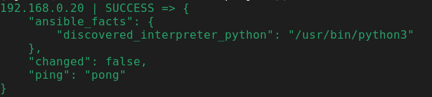
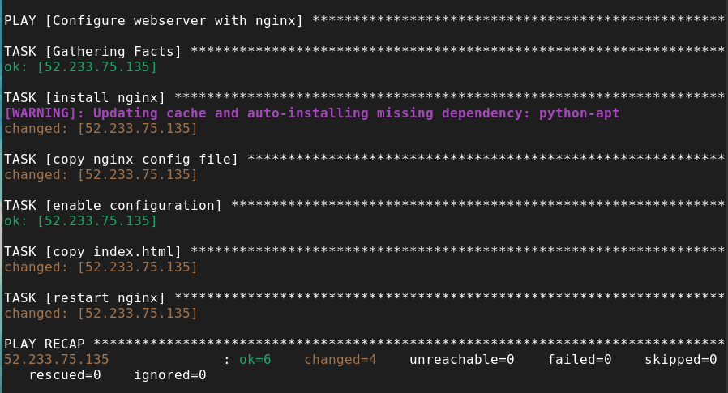
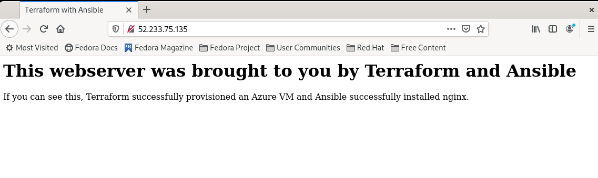
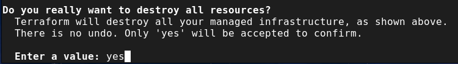
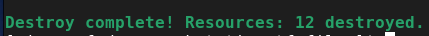
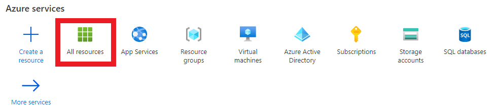
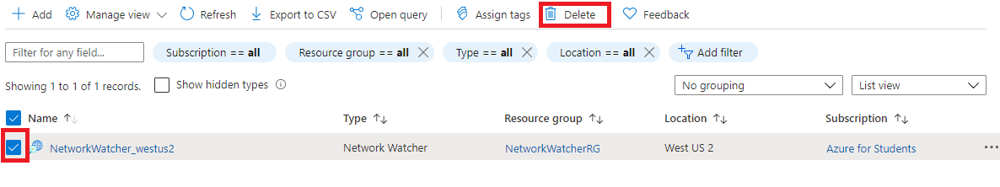

# About
The purpose of this project was to familiarize myslef with *Terraform*, *Ansible*, and the *Azure* cloud platform. 

Terraform was used to provision a Linux VM in Azure. Then Ansible was used to configure that VM with NGINX.

## Pre-requisites

### Ansible
* MacOS or Linux Distribution (Control Node)
* Python2 (v2.7) or Python3 (v3.5+)
* [Installing ansible](https://docs.ansible.com/ansible/latest/installation_guide/index.html)

### Terraform
* [Download/install Terraform](https://www.terraform.io/downloads.html)

### Cloud Provider
For this project I used Azure as my cloud provider.

* [Azure Subscription](https://azure.microsoft.com/en-us/free/)
* [Azure CLI](https://docs.microsoft.com/en-us/cli/azure/install-azure-cli)

## Initial Setup and Config

### Connecting to your Azure Account

After installing the *Azure CLI*, sign in to Azure with the CLI.

* Open up the terminal and run the `login` command

    * ```az login```
* The CLI will open a browser page if it can 
    * Sign in to your *Azure* account with your credentials.

### SSH Public Key Authentication
Ansible by default assumes you are using SSH keys to connect to remote machines.
* generate SSH key-pair
    * `ssk-keygen -t rsa -b 4096`
* You will be prompted to supply a filename and path where you want to save the file
    * press the **"enter"** key to accept the default filename and path.
* You will then be prompted to enter a passphrase, you have two options:
    * For no passphrase - press **"enter"** key
    * Passphrase - type passphrase
        * press the **"enter"** key
        * enter the passphrase again to confirm, and press the **"enter"** key one more time
* You will recieve some output telling you where your private and public keys are stored.

### Clone project
* get a local copy of the project
    * `git clone https://github.com/MJRAMZ/terraform-ansible-nginx.git`

## Provisoning the VM with TF

* navigate to the **"terraform"** directory of your local repo copy
    * `cd terraform`
* initialize the configuration file
    *  `terraform init`
* create an execution plan
    * `terraform plan`
* apply the plan
    * `terraform apply`

## Connecting Ansible to the remote VM

Once the VM is provisioned. You need to edit some of the configuration files to get Ansible to communicate with your VM.

### Getting VM's public IP
First start by getting your VM's public IP address.
* get the VM's public IP with `az vm show`
    * `az vm show --resource-group myTFResourceGroup --name myVM -d --query [publicIps] -o tsv`

You can also get your VM's IP address by logging in to your Azure account and using the Azure portal.

### Establishing SSH fingerprint
* remotely connect to the VM
    * `ssh azureuser@<VM_IP_Address>`
* You will be prompted for the password for VM
    * enter password: `test1234!`
* If ssh connection was successful your terminal should look like this:
    * `azureuser@<VM_IP_Address>`
* Type **"exit"** and press **"enter"** to end the remote session

### Copy the public key
* copy public key to remote VM
    * `ssh-copy-id azureuser@<VM_IP_Addres>`
* login to the VM with username and password
* You should see some output letting you know that the key was copied.
* exit the remote session

Now when you **ssh** into the VM the connection will be authenticated using the public/private key-pair.

### Ansible configuration
* open and edit the **"hosts"** configuration file
    * `sudo vim /etc/ansible/hosts
* create a group and establish the IP address for the VM
    * ```
        [<server_group_name>]
        <your_VM_IP_Address>
        ```
* Open and edit the **"ansible.cfg"** file
    * uncomment the **"inventory"** line
        * `#inventory   = /etc/ansible/hosts`
        * `inventory   = /etc/ansible/hosts`
    * add the following below the **"inventory"** line
        * ```
            remote_user = azureuser
            private_key_file = ~/.ssh/id_rsa
            ```

### Testing the connection
* run the following command to see if you can connect to the VM through Ansible
    * `ansible <group_name> -m ping`
* you should receive the following output for a successful connection
    * 

## Running the playbook

### Configure VM with NGINX
* navigate to the playbooks directory
    * `cd terraform-ansible-nginx/ansible/playbooks`
* use the following command to run the playbook
    * `ansible-playbook nginx.yml`
* you should see output similar to this:
    * 
### Check the webserver
* open up a web browser
* navigate to your VM through its public IP address
    * `http://<your_VM_IP_Address>`
* if everything worked correctly you should see the display message.
    * 

## Teardown Infrastructure

### Terraform Destroy
* you can teardonw your infrastrucutre by using the `destroy` command
    * `terraform destroy`
* You will be met with a prompt asking if yor are sure you want to tear everything down
    * 
    * type: **yes** and hit enter
* When Terraform is done you will get some output notifying you that the process is now complete
    * 

### Clean up stray resources
Although Terraform does its best to tear everything down, there may be a stray resource or resource group that needs to be cleaned up.

You can clean up stray resources by logging into your **Azure** account and navigating to the ***All resources*** section of the Azure portal



Select the checkbox of the resource you want to delete and click the *trash-bin* icon that says **delete**.



## References
Used the following resources as a guide, adjusting the code templates as needed to get things working.

* [Azure Terraform Docs](https://docs.microsoft.com/en-us/azure/developer/terraform/create-linux-virtual-machine-with-infrastructure)
* [Terraform Azure Provider Docs ](https://registry.terraform.io/providers/hashicorp/azurerm/latest/docs)
* [Ansible User Guide Docs](https://docs.ansible.com/ansible/latest/user_guide/index.html)
* [Ansible: Up and Running, 2nd Ed.](https://www.oreilly.com/library/view/ansible-up-and/9781491979792/)
* [Terraform Up and Running, 2nd Ed.](https://www.oreilly.com/library/view/terraform-up/9781492046899/)